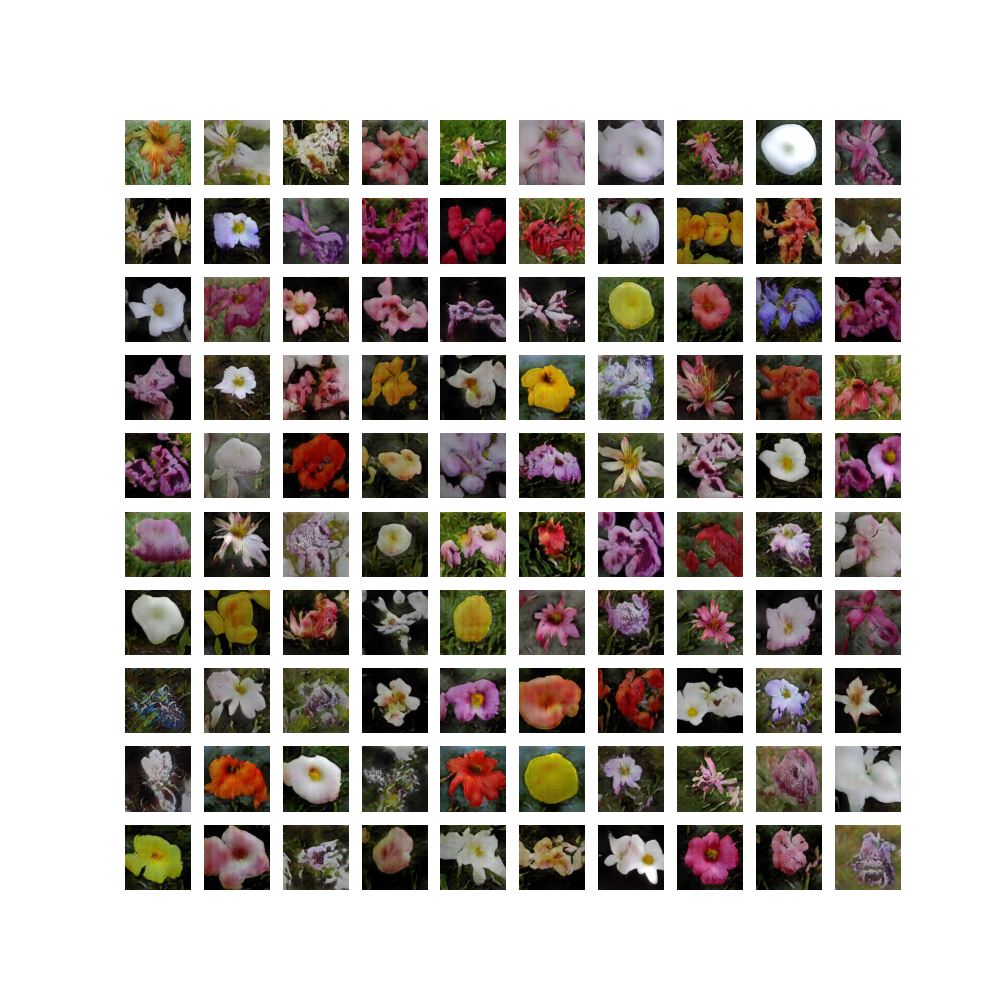
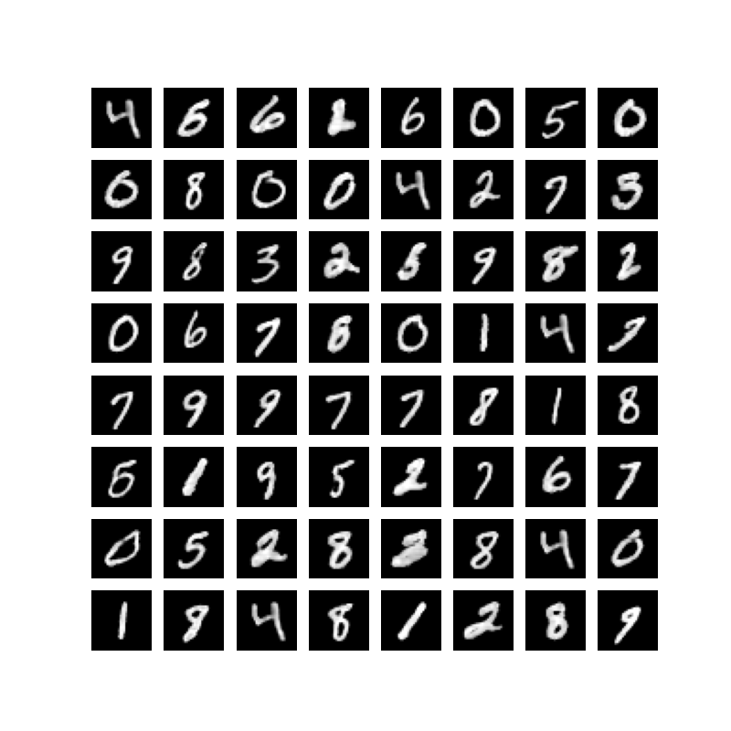

# Unofficial StyleGAN2 implementation with tensorflow 2.2

This is an unofficial tensorflow 2.2 based re-implementation of the original [StyleGAN2](https://github.com/NVlabs/stylegan2) published in:


> T. Karras, S. Laine, M. Aittala, J. Hellsten, J. Lehtinen, and T. Aila\
*Analyzing and Improving the Image Quality of StyleGAN*\
https://arxiv.org/abs/1912.04958v2

Here are some flowers:



And some GAN-written digits:



The implemented features include:

Features:
- Weight modulation/demodulation
- Lazy regularization
- Label conditioning 
- Skip architecture generator
- Resnet architecture discriminator
- Truncation trick
- Works on both GPU and CPU
- Docker image is provided

Todo:
- Style mixing regularization
- Path length regularization

## Data preparation
The networks consume the training data from a tfrecord file. For each record, this contains the raw pixel value of the rectangular images in HWC ordering and potentially a vector of one-hot encoded class labels. The resolution must be a power of two. To generate the training data, specify the resolution in the config file and run:

```bash
python preprocess_data.py \
--config_path ./config/flowers.yaml \
--dataset flowers \
--raw_data_path ./data/flowers/jpg \
--data_out_path ./data/flowers
```

## Training
To start the training, run:

```bash
python run_training.py \
--config_path ./config/flowers.yaml \
--data_path ./data/flowers/flowers.tfrecords
```

## Generate Fakes
To generate fake images from the checkpoints written during training, run:

```bash
python generate_fakes.py \
--config_path ./config/flowers.yaml \
--num_fake_batches 10 \
--checkpoint_dir ./checkpoints/flowers/models \
--generated_images_dir ./generated_images/flowers
```

This will loop through all checkpoint in the `checkpoint_dir` and generate a grid of `num_fake_batches` * `batch_size` generated images. Use `truncation_psi` and `truncation_cutoff` to control the variance of the generated fake images. 

## Docker

The steps above can be run in docker, using the image `cmeyr/stylegan2-tf2:latest`. For example:

```bash
docker run -d \
--rm \
-v "$PWD/config:/app/config" \
-v "$PWD/logs:/app/logs" \
-v "$PWD/checkpoints:/app/checkpoints" \
-v "$PWD/data:/app/data" \
--name stylegan2_tf2_training \
cmeyr/stylegan2-tf2:latest \
python -u run_training.py \
--config_path ./config/flowers.yaml \
--data_path ./data/flowers/flowers.tfrecords
```

If you are running on a GPU, please also set the option `--runtime=nvidia`. You can build the image yourself by running `./build_docker_image.sh`.